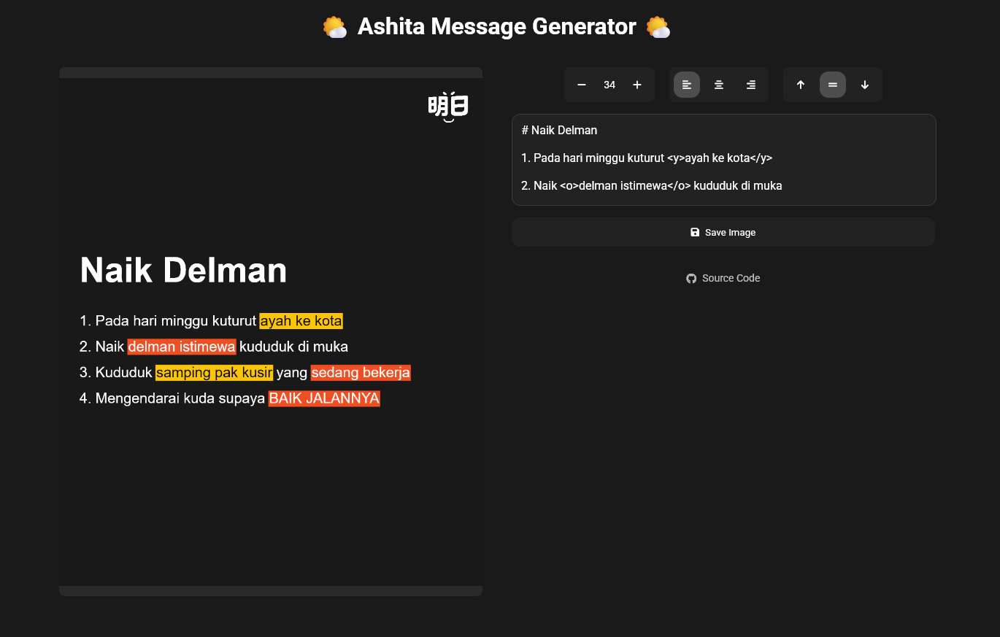

# 🌤️ Ashita Message Generator

A beautiful web-based tool for creating stylized text overlays with markdown support and highlighting. Perfect for social media posts, **clarifications**, and announcements.

## 🖼️ Screenshot




## ✨ Features

### 🎨 Text Styling
- **Markdown Support**: Use `# Title` for headers with automatic size scaling
- **Highlighting**: Support for `<y>yellow highlights</y>` and `<o>orange highlights</o>`
- **Multi-line Text Wrapping**: Intelligent text wrapping that preserves highlighting across line breaks
- **Font Customization**: Adjustable font sizes with clean Arial typography

### 📐 Layout Controls
- **Text Alignment**: Left, center, and right horizontal alignment
- **Vertical Positioning**: Top, middle, and bottom vertical alignment
- **Responsive Design**: Works on both desktop and mobile devices

### 🖼️ Visual Design
- **Dark Theme**: Modern dark background (#191919) for better contrast
- **Ashita Logo**: Custom logo in the top-right corner
- **High Resolution**: 1000x1200 canvas for crisp output
- **Smooth Highlighting**: Continuous highlight backgrounds without visual artifacts

## 🚀 Usage

### Basic Text
Simply type your text in the textarea and see it rendered in real-time on the canvas.

### Titles
Use markdown-style headers:
```
# Main Title
## Subtitle
### Small Title
```

### Highlighting
Add colored highlights to emphasize important text:
```
This is normal text with <y>yellow highlights</y> and <o>orange highlights</o>.
```

### Example
```
# Naik Delman

1. Pada hari minggu kuturut <y>ayah ke kota</y>

2. Naik <o>delman istimewa</o> kududuk di muka

3. Kududuk <y>samping pak kusir</y> yang <o>sedang bekerja</o>

4. Mengendarai kuda supaya <o>BAIK JALANNYA</o>
```

## 🎛️ Controls

### Font Size
- **-** and **+** buttons to decrease/increase font size
- Range: 12px to 72px

### Text Alignment
- **Left Align**: Text starts from the left margin
- **Center Align**: Text is centered horizontally
- **Right Align**: Text ends at the right margin

### Vertical Positioning
- **Top**: Text starts from the top
- **Middle**: Text is vertically centered
- **Bottom**: Text ends at the bottom

### Export
- **Save Image**: Downloads the generated image as PNG

## 🛠️ Technical Details

### Technologies Used
- **HTML5 Canvas**: For high-quality text rendering
- **JavaScript**: Pure vanilla JS for all functionality
- **CSS3**: Modern styling with backdrop filters and responsive design

### Key Features Implementation
- **Smart Text Wrapping**: Preserves highlight information across line breaks
- **Two-Pass Rendering**: Backgrounds drawn first, then text to prevent overlaps
- **Responsive Canvas**: Scales properly on different screen sizes
- **Real-time Preview**: Updates as you type

### File Structure
```
├── index.html          # Main HTML structure
├── styles.css          # Styling and responsive design
├── script.js           # Core functionality and canvas rendering
├── assets/
│   └── ashita.png     # Logo image
└── README.md          # This file
```

## 📱 Browser Support

- ✅ Chrome/Chromium (recommended)
- ✅ Firefox
- ✅ Safari
- ✅ Edge
- ✅ Mobile browsers

## 🚀 Getting Started

1. Clone or download this repository
2. Open `index.html` in a web browser
3. Start typing in the textarea
4. Use the controls to adjust styling
5. Click "Save Image" to download your creation

## 📄 License

This project is licensed under the [MIT License](./LICENSE).

## 🤝 Contributing

Contributions are welcome! Feel free to:
- Report bugs
- Suggest new features
- Submit pull requests
- Improve documentation

## 🔗 Links

- **Live Demo**: [ashitagenshin.sena.dev](https://ashitagenshin.sena.dev)
- **Source Code**: [GitHub Repository](https://github.com/senacand/ashita-message-generator)

## ⚠️ Disclaimer

This project is intended for educational and entertainment purposes only. It is not affiliated with or endorsed by any official entities or organizations referenced. Please use responsibly.
